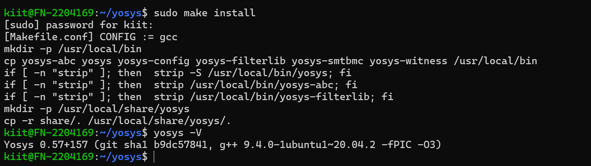
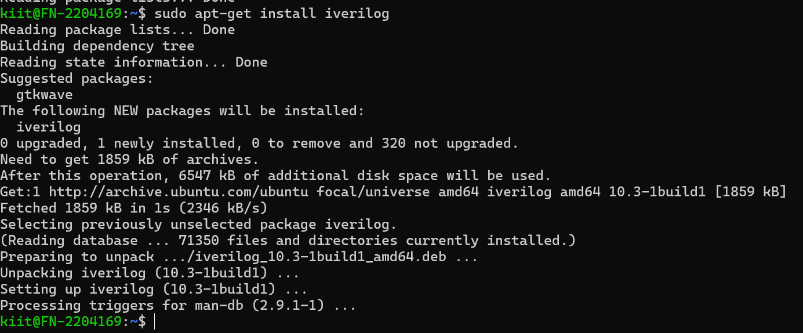
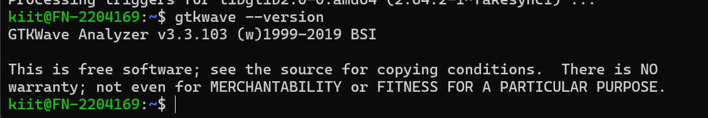

VSD-RISCV-SoC Environment and Tool Setup
This document outlines the system specifications and the complete installation process for the required tools: Yosys, Icarus Verilog, and GTKWave.

System Specifications
The development environment was configured on an Ubuntu 20.04 (or higher) system with the following minimum requirements:

RAM: 6 GB

HDD: 50 GB

CPU: 4 vCPU

Tool Installation
Yosys (Synthesis Tool)
Yosys was installed by building from the source code to ensure the latest version.

Installation Commands:

sudo apt-get update
git clone https://github.com/YosysHQ/yosys.git
cd yosys
sudo apt-get install build-essential clang bison flex \
libreadline-dev gawk tcl-dev libffi-dev git \
graphviz xdot pkg-config python3 libboost-system-dev \
libboost-python-dev libboost-filesystem-dev zlib1g-dev
make config-gcc
git submodule update --init --recursive
make
sudo make install
Installation Snapshot:

Icarus Verilog (Simulation Tool)
Icarus Verilog was installed using the apt package manager.

Installation Command:

sudo apt install iverilog
Installation Snapshot:

GTKWave (Waveform Viewer)
GTKWave was installed using the apt package manager.

Installation Command:

sudo apt install gtkwave
Installation Snapshot:

